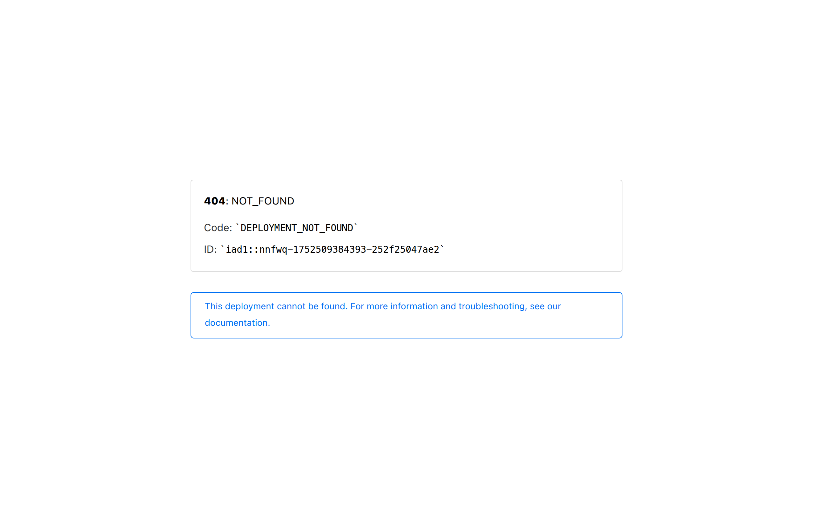
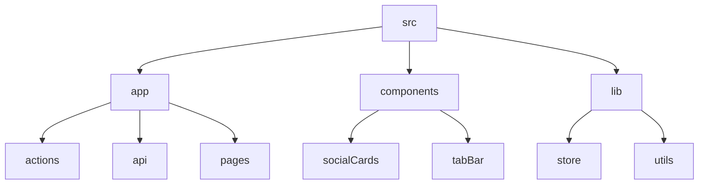

# GitFull: AI-Powered GitHub README Generator 🤖

## 🗂️ Description

GitFull is an innovative application that leverages AI to generate high-quality README files for GitHub repositories. This project aims to simplify the process of creating engaging and informative README files, making it easier for developers to showcase their projects. GitFull is designed for developers, maintainers, and contributors who want to create professional-looking README files without spending too much time.

The application uses a combination of GitHub API, Groq API, and Next.js to provide a seamless experience. With GitFull, users can select a repository, choose a branch, and generate a README file with a thumbnail image. The AI-powered engine analyzes the repository's file structure and content to create a well-structured README document.

## ✨ Key Features

### Core Features

* **README Generation**: AI-powered README file generation based on repository content
* **GitHub Integration**: Seamless integration with GitHub API for repository and branch data
* **Thumbnail Generation**: Automatic thumbnail image generation for README files

### UI Features

* **Tab Bar**: Interactive tab bar for navigation
* **Social Cards**: Social media-style cards for Twitter, LinkedIn, and Bugspot
* **File Scroll Animation**: Animated file scroll component for README files

### Authentication and Authorization

* **NextAuth**: Secure authentication and authorization using NextAuth

## 🗂️ Folder Structure

## 🛠️ Tech Stack

* **Next.js**: React-based framework for building server-rendered and statically generated web applications
* **React**: JavaScript library for building user interfaces
* **TypeScript**: Superset of JavaScript for type safety and maintainability
* **Tailwind CSS**: Utility-first CSS framework for styling
* **PostCSS**: CSS post-processor for advanced styling features
* **ESLint**: JavaScript linter for code quality and consistency
* **Groq API**: Large language model for AI-powered content generation

## ⚙️ Setup Instructions

* Clone the repository: `git clone https://github.com/abhraneeldhar7/gitfull.git`
* Install dependencies: `npm install` or `yarn install`
* Start the development server: `npm run dev` or `yarn dev`
* Open your browser and navigate to `http://localhost:3000`

Make sure to configure your GitHub and Groq API credentials to use the application.