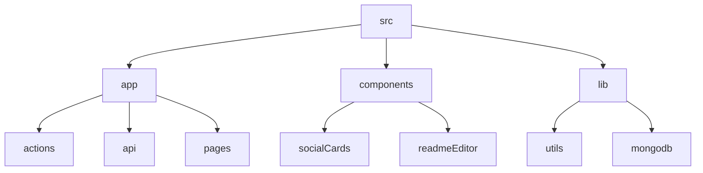

# GitFull: AI-Powered GitHub Repository Summarizer

## 🗂️ Description

GitFull is a web application designed to simplify the process of creating and managing GitHub repository READMEs. It uses AI-powered summarization to generate high-quality README content from repository code files. The application is built for developers, repository owners, and contributors who want to create engaging and informative READMEs without spending too much time.

The application integrates with GitHub APIs to fetch repository data, generate summaries, and push changes back to the repository. It also features a user-friendly interface for editing and previewing README content.

## ✨ Key Features

### Core Features

* **AI-Powered Summarization**: Generates high-quality README content from repository code files using Groq API
* **GitHub Integration**: Integrates with GitHub APIs to fetch repository data, generate summaries, and push changes
* **README Editor**: A user-friendly interface for editing and previewing README content

### User Interface

* **Dashboard**: Displays repository information, including owner details, repository description, language breakdown, and file analysis progress
* **Tab Bar**: A navigation menu that allows users to switch between different screens
* **Social Cards**: Displays repository information in a visually appealing format

### Technology Integration

* **NextAuth**: Handles authentication and authorization with GitHub
* **MongoDB**: Stores repository data and user information
* **Tailwind CSS**: A utility-first CSS framework for styling the application

## 🗂️ Folder Structure

## 🛠️ Tech Stack

## ⚙️ Setup Instructions

To run the project locally, follow these steps:

* Clone the repository: `git clone https://github.com/abhraneeldhar7/gitfull.git`
* Install dependencies: `npm install` or `yarn install`
* Start the development server: `npm run dev` or `yarn dev`

## GitHub Actions

The repository uses GitHub Actions to automate various tasks, such as:

* **Build and Deploy**: Builds and deploys the application to a production environment
* **Code Quality**: Runs code quality checks, including linting and type checking

Note: GitHub Actions workflows are defined in the `.github/workflows` directory.

  

<h3>Abhra the Neel</h3>

Full-stack developer with expertise in web, Android, and server-side development. Most projects are private due to being production code.

 

  <a href="https://gitfull.vercel.app">Made by GitFull</a>

    