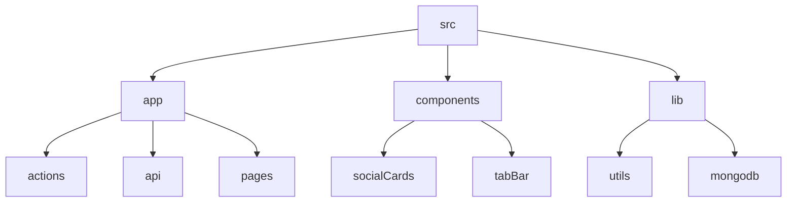

# GitFull: A GitHub Repository Summarizer

## 🗂️ Description

GitFull is a web application that generates summaries of GitHub repositories. It uses the GitHub API and natural language processing techniques to provide an overview of a repository's contents, including its files, technologies used, and key features. This project is designed for developers, researchers, and anyone interested in quickly understanding the structure and purpose of a GitHub repository.

The application allows users to authenticate with GitHub, select a repository, and view a summary of its contents. The summary includes information about the repository's files, technologies used, and key features. The application also provides a README editor, which allows users to edit and preview a README file for the selected repository.

## ✨ Key Features

* **Repository Summarization**: Generate summaries of GitHub repositories using natural language processing techniques
* **GitHub Authentication**: Authenticate with GitHub to access repository data
* **README Editor**: Edit and preview README files for selected repositories
* **Technology Stack Detection**: Detect technologies used in a repository
* **File Tree Visualization**: Visualize the file tree of a repository

## 🗂️ Folder Structure

## 🛠️ Tech Stack

## ⚙️ Setup Instructions

To run the project locally, follow these steps:

* Clone the repository: `git clone https://github.com/abhraneeldhar7/gitfull.git`
* Install dependencies: `npm install` or `yarn install`
* Start the development server: `npm run dev` or `yarn dev`

## GitHub Actions

The project uses GitHub Actions to automate tasks such as crediting tokens to users. The `.github/workflows/credit-tokens.yml` file defines a workflow that runs a cron job to execute the `/api/credit-tokens` endpoint.

## Vercel Configuration

The project uses Vercel as its deployment platform. The `vercel.json` file defines a configuration that schedules a cron job to run the `/api/credit-tokens` endpoint.

## API Endpoints

The project exposes several API endpoints, including:

* `/api/auth/[...nextauth]/route.ts`: NextAuth API route handler for authentication
* `/api/credit-tokens/route.ts`: API endpoint that credits tokens to all users

## 📁 File Summaries

The project consists of several files and directories. Here are some key files:

* `app/api/auth/[...nextauth]/route.ts`: NextAuth API route handler for authentication
* `app/api/credit-tokens/route.ts`: API endpoint that credits tokens to all users
* `lib/mongodbCS.ts`: MongoDB connection file that provides a function to get a database instance
* `components/readmeEditor/readmeEditor.tsx`: README editor component that allows users to edit and preview README files
* `lib/utils.ts`: Utility module that exports various functions for tasks such as string manipulation and date formatting

  

<h3>Abhra the Neel</h3>

Full-stack developer with experience in web, Android, and server development. Most projects are private due to being production code.

 

  <a href="https://gitfull.vercel.app">Made by GitFull</a>

    